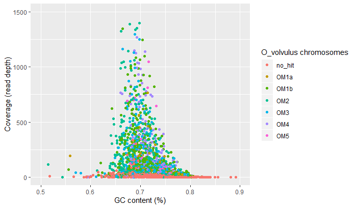
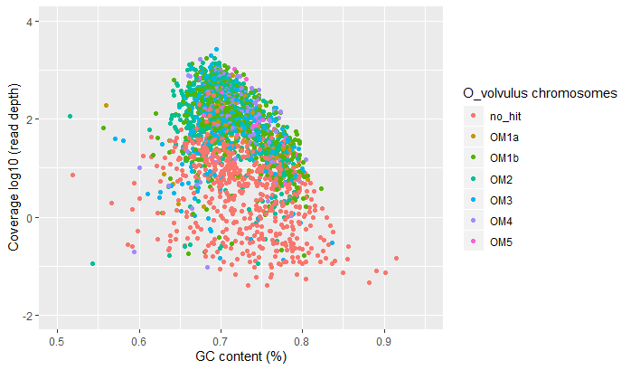
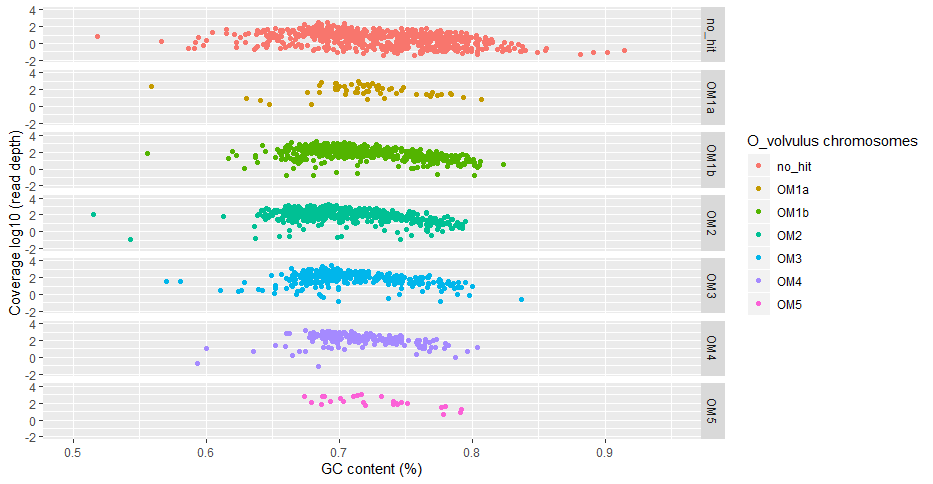
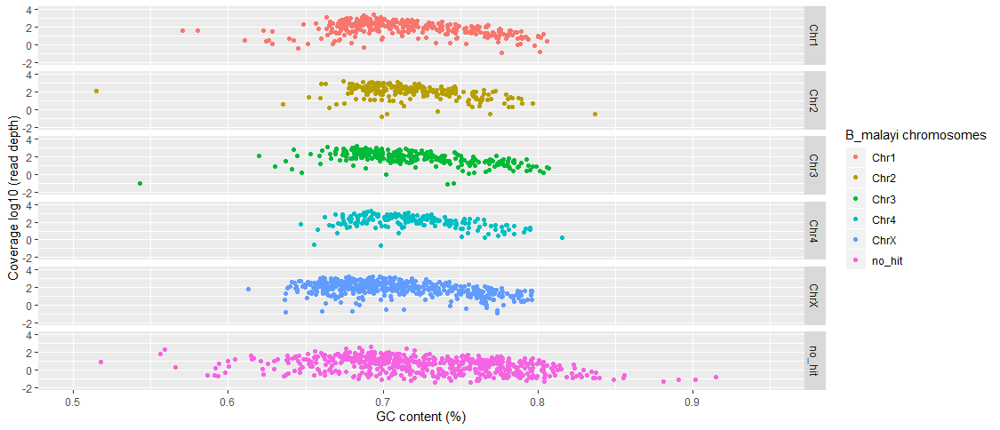

# Workspace for the Cercopithifilaria johnstoni genome project

## Authors:
- Kirsty McCann (La Trobe University)
- Stephen Doyle (Wellcome Sanger Institute, ex LTU)


## Sequencing and raw reads
### Sequencing
- sequencing was performed by Steve at LTU on an Illumina MiSeq using a V3 600 cycle (2x300 bp) sequencing kit


### Raw reads
- raw reads were checked using FastQC before analysis
- this was done at LTU years back (2015?), and I don't have the analysis anymore, but would be easy to regenerate
- it was clear from this data the drop in sequencing quality beyond 150-200 bp of the long MiSeq reads. While this is acceptable for some applications, it turned out not to be for assembly from the initial assemblies produced. Hence, the reads were trimmed quite hard as described below.


### Trimming
- reads were trimmed using Trimmomatic
- found that assemblies with full length reads were suboptimal to trimmed reads, trimmed not only for quality by also for length. Given the high coverage, hard trimmed back to 150 bp together with quality trimming was a good compromise and worked well.

```bash
module load trimmomatic/0.39--1

run_trimmomatic CJ Cj3-500-700_S1_L001_R1_001.fastq.gz Cj3-500-700_S1_L001_R2_001.fastq.gz

```
- where "run_trimmomatic" is:
```bash
out_prefix=$1
read_1=$2
read_2=$3


java -jar /software/pathogen/external/apps/usr/local/Trimmomatic-0.32/trimmomatic-0.32.jar PE \
-threads 4 \
-phred33 \
${read_1} ${read_2} \
${out_prefix}.paired_R1.fastq.gz ${out_prefix}.unpaired_R1.fastq.gz \
${out_prefix}.paired_R2.fastq.gz ${out_prefix}.unpaired_R2.fastq.gz \
ILLUMINACLIP:/nfs/users/nfs_s/sd21/databases/trimmomatic_Illumina-adapters.fa:2:30:10 \
CROP:150 SLIDINGWINDOW:10:20 MINLEN:100
```

### Genome Scope
- Genome Scope was used to estimate the genome size from the raw reads
```bash
# un gzip the raw data
gunzip *.gz

# run jellyfish
jellyfish count -C -m 21 -s 1000000000 -t 10 *.fastq -o reads.jf

jellyfish histo -t 10 reads.jf > reads.histo

# use the "reads.histo" as input to genomescope

# output of run: http://genomescope.org/analysis.php?code=8JHWvmV1sukF1nGshxjY
# rerun in genomescope2: http://genomescope.org/genomescope2.0/analysis.php?code=wN4P2Ru51VfnpIQwHcz6

```
- Genomescope2 output

| property | min | max |
| --- | --- | --- |
| Homozygous | 98.9614% | 98.9724% |
| Heterozygous | 1.02756% | 1.03864% |
| Genome Haploid Length | 63,161,930 bp | 63,240,284 bp |
| Genome Repeat Length | 3,104,451 bp | 3,108,302 bp |
| Genome Unique Length | 60,057,479 bp | 60,131,982 bp |     
| Model Fit | 96.8819% | 99.1873% |
| Read Error Rate | 0.209979% | 0.209979% |


## Genome assembly
- assembly was performed by Kirsty at La Trobe using Spades with default parameters


## genome improvement
- Genome improvement performed by Steve at Sanger
- output of spades (as presented in Kirsty's thesis)
/nfs/users/nfs_s/sd21/lustre118_link/cercopithifilaria_johnstoni/scaffolds.fasta

- strategy
     - redundans (without reads) - remove haplotypes
     - blobtools - remove contaminants
     - opera - rescaffold
     - redundans (with reads) - scaffold and gapfill


### Redundans
- using redundans first to identifiy and remove excess haplotypic sequneces
```bash
# run redundans
/nfs/users/nfs_s/sd21/lustre118_link/software/GENOME_IMPROVEMENT/redundans/redundans.py --fasta scaffolds.fasta --outdir REDUNDANS_OUT

```

### Blobtools
- using blobtools to identify and filter potnetial contaminants in the assembly
```bash
# get taxdump
curl -L ftp://ftp.ncbi.nih.gov/pub/taxonomy/new_taxdump/new_taxdump.tar.gz | tar xzf -

#--- fix reference, and split it into 100 reads per file - this will help speed up the blast
fastaq to_fasta -l0 scaffolds.reduced.fa scaffolds.reduced.l0.fa

split --lines=200 scaffolds.reduced.l0.fa

#--- run blast, with a separate blast job per 100 reads
for i in x*; do \
     bsub.py 10 --queue long --threads 16 blast /lustre/scratch118/infgen/team133/ea10/miniconda/bin/blastn \
     -db /data/blastdb/Supported/NT/nt \
     -query ${i} \
     -outfmt \"6 qseqid staxids bitscore std\" \
     -max_target_seqs 10 \
     -max_hsps 1 \
     -evalue 1e-25 \
     -num_threads 16 \
     -out ${i}_blast.out;
done

cat *blast.out > blast.out
rm x*


# generate coverage data
#--- use minimap to map reads to generate a bam for blobtools coverage stats

minimap2 -ax sr -t 16 scaffolds.reduced.fa Cj3-500-700_S1_L001_R1_001.fastq.gz Cj3-500-700_S1_L001_R2_001.fastq.gz | samtools sort -@16 -O BAM -o cj_mapped.bam -


# run blobtools
/nfs/users/nfs_s/sd21/lustre118_link/software/ASSEMBLY_QC/blobtools/blobtools create -i scaffolds.reduced.fa -b cj_mapped.bam -t blast.out -o CJ_blobtools_out

/nfs/users/nfs_s/sd21/lustre118_link/software/ASSEMBLY_QC/blobtools/blobtools plot -i CJ_blobtools_out.blobDB.json

/nfs/users/nfs_s/sd21/lustre118_link/software/ASSEMBLY_QC/blobtools/blobtools view -i CJ_blobtools_out.blobDB.json


# filter blobtools output
#--- only keep blast hits to nematoda and no-hit
grep "Nematoda\|no-hit" CJ_blobtools_out.blobDB.table.txt | cut -f1 > blobtools_filter_byhit.list

#--- only keep sequences with the read depth >10
awk '{if($3>10) print $1}' CJ_blobtools_out.cj_mapped.bam.cov > blobtools_filter_bycov_gt10.list

#--- only keep sequences that pass both filters
cat blobtools_filter_byhit.list blobtools_filter_bycov_gt10.list | sort | uniq -c | awk '{if($1==2) print $2}' > blobtools_filter_bycov_gt10_byhit.list


# remake fasta using filtered list of sequences
while read i; do
     samtools faidx scaffolds.reduced.fa ${i} >> scaffolds.reduced.bt_filter.fa;
done < blobtools_filter_bycov_gt10_byhit.list

```


### Rescaffold with opera
- this attempts to identify unique joins in the assembly now some of the haplotypes have been removed
```bash
# run bowtie to generate a mapping file
bowtie2-build scaffolds.reduced.bt_filter.fa contigs

bowtie2 -k 5 -x contigs -X 1000 --rf -p 32 -1 Cj3-500-700_S1_L001_R1_001.fastq.gz -2 Cj3-500-700_S1_L001_R2_001.fastq.gz -S cj_bowtie2.sam

# run opera
/nfs/users/nfs_s/sd21/lustre118_link/software/GENOME_SCAFFOLDING/OPERA-LG_v2.0.4/bin/OPERA-LG scaffolds.reduced.bt_filter.fa cj_bowtie2.sam opera_out
```


### Rescaffold and gapfill the opera output using Redundans again
- the second round of redundans aims to use the short reads again to fill gaps in the assembly
```
# run redundans, this time with reads, to scaffold and gapfill
/nfs/users/nfs_s/sd21/lustre118_link/software/GENOME_IMPROVEMENT/redundans/redundans.py -f scaffoldSeq.fasta -i ../Cj3-500-700_S1_L001_R1_001.fastq.gz ../Cj3-500-700_S1_L001_R2_001.fastq.gz -o rescaffold -t 16

```


## Genome annotation
### Preparation of hints for running BRAKER
- preparation of hints for braker using PROTHINT (https://github.com/gatech-genemark/ProtHint)

```bash
/nfs/users/nfs_s/sd21/lustre118_link/software/TRANSCRIPTOME/ProtHint/bin/prothint.py --threads 20 ../cjohnstoni_genome_200917.fasta /nfs/users/nfs_s/sd21/lustre118_link/software/TRANSCRIPTOME/ProtHint/databases/odb10_metazoa/odb10_metazoa_proteins.fa
```


### Running BRAKER
- annotation using braker
```bash
export AUGUSTUS_CONFIG_PATH=/nfs/users/nfs_s/sd21/software/augustus-3.2.1/config
export AUGUSTUS_SCRIPTS_PATH=/nfs/users/nfs_s/sd21/software/augustus-3.2.1/scripts
export BAMTOOLS_PATH=/nfs/users/nfs_s/sd21/lustre118_link/software/bamtools/bin
export GENEMARK_PATH=/nfs/users/nfs_s/sd21/lustre118_link/software/TRANSCRIPTOME/ProtHint/dependencies/GeneMarkES
export LD_LIBRARY_PATH=$LD_LIBRARY_PATH:/software/gcc-4.9.2/lib64/libstdc++.so.6
export BAMTOOLS_PATH=/nfs/users/nfs_s/sd21/lustre118_link/software/bamtools/bin

# had to remove pipes in fasta headers to get braker to run
sed -i 's/|/_/g' cjohnstoni_genome_200917.fa
sed -i 's/|/_/g' prothint_augustus.gff3

bsub.py --queue long --threads 20 20 braker2 "/lustre/scratch118/infgen/team133/sd21/software/TRANSCRIPTOME/BRAKER_v2.0/braker.pl --genome=cjohnstoni_genome_200917.fa --hints=prothint_augustus.gff3 --gff3 --cores 20 --extrinsicCfgFile=extrinsic.M.RM.E.W.P.C.cfg"


# annotation stats
gag.py -f ../../cjohnstoni_genome_200917.fa -g augustus.gff3

```

### Updating gene IDs in the annotation
- Braker / Augustus generates a very generic set of gene IDs, which wont be unique relative to other assemblies using the same approach
- used the pipeline below to add "CJOH_" followed using a unique 8 digit identifier that increments by a value of 10 per annotation. This provides plenty fo naming space to modify and add models in the future if/when needed
- note that the genome models of the mtDNA genome was manually annotated.

```bash
#working dir = /nfs/users/nfs_s/sd21/lustre118_link/cercopithifilaria_johnstoni/FINAL_GENOME

gff=cjohnstoni_annotation.210825.gff3
species_prefix=CJOH_

# copy gff to a tmp file - just to avoid doing something silly like overwriting original
cat ${gff} | grep -v "#" > ${gff}.tmp

# STEP 1 - generate using IDs for each gene
# - extract gene name from lines in gff matching gene|GENE
# - remove surrounding characters
# - sort by gene ID and remove duplicates
# - print new gene id (species prefix with 8 digit ID that increases by 10 for each gene), and old gene id

awk -F'[\t;]' '{if($3=="gene" || $3=="GENE") print $9}' ${gff}.tmp | sed -e 's/ID=//g' -e 's/\;//g' | sort -V | uniq | awk -v species_prefix="$species_prefix" '{fmt=species_prefix"%08d\t%s\n"; printf fmt,NR*10,$0}' > genes_renames.list


# pasa dependent fix
cat genes_renames.list | sed 's/gene/mRNA/g' >  mRNA_renames.list

# STEP 2 - replace gene IDs
# - read new / old gene IDs from above
# - replace IDs, recognising differences in placement of gene, mRNA, and progeny
# NOTE: match - equal sign at beginning, followed by one of [.;$] where $ is the end of the line, which is what AUGUSTSUS / BRAKER produce - this might have to be tweaked for other outputs
# NOTE: eg.  =XXX[. ;]

while read new_gene old_gene; do
     grep "ID=$old_gene[.;$]" ${gff}.tmp | sed -e "s/=${old_gene}[.]/=${new_gene}\./g" -e "s/=${old_gene}[;]/=${new_gene}\;/g" -e "s/=${old_gene}$/=${new_gene}/g" -e "s/Name=.*$/Name=${new_gene}/g";
done < genes_renames.list > ${gff%.gff*}.genesrenamed.tmp


# fix end of line characters
sed -i 's/;$//g' ${gff%.gff*}.genesrenamed.tmp


echo "##gff-version 3" > ${species_prefix}.renamed.gff3; cat ${gff%.gff*}.genesrenamed.tmp | sort -k1,1 -k4,4n >> ${species_prefix}.renamed.gff3

# add mtDNA annotation to the end
cat ${species_prefix}.renamed.gff3 C_johnstoni_mt_annotation.SD210906.gff.tmp > tmp; mv tmp ${species_prefix}.renamed.gff3

# final fix, merging nuclear and mtDNA genomes
mv CJOH_.renamed.gff3 cercopithifilaria_johnstoni_annotation_SD210906.gff3

cat cjohnstoni_genome_210825.fa C_johnstoni_mt_draft_genome.fasta > cercopithifilaria_johnstoni_genome_SD210906.fasta

# clean up ready for submission to ENA / WBP
gt gff3 -sort -tidy -retainids cercopithifilaria_johnstoni_annotation_SD210906.gff3 > tmp; mv tmp cercopithifilaria_johnstoni_annotation_SD210906.gff3

grep -v "###" cercopithifilaria_johnstoni_annotation_SD210906.gff3 > tmp ; mv tmp cercopithifilaria_johnstoni_annotation_SD210906.gff3
```


## Assessing genome completeness using BUSCO

### Running BUSCO to examine iteratative analysis of genome improvements
```bash
cd /nfs/users/nfs_s/sd21/lustre118_link/cercopithifilaria_johnstoni/BUSCO

bsub.py --queue long --threads 30 20 busco5 ~sd21/bash_scripts/run_busco_nematode.sh ORIGINAL original.fa
bsub.py --queue long --threads 30 20 busco6 ~sd21/bash_scripts/run_busco_nematode.sh REDUNDANS redundans.fa
bsub.py --queue long --threads 30 20 busco7 ~sd21/bash_scripts/run_busco_nematode.sh BLOBTOOLS blobtools_filter.fa
bsub.py --queue long --threads 30 20 busco10 ~sd21/bash_scripts/run_busco_nematode.sh OPERA opera.fa
bsub.py --queue long --threads 30 20 busco11 ~sd21/bash_scripts/run_busco_nematode.sh OPERA_RESCAFFOLD opera_rescaffold.fa

```


### Running BUSCO for genome assemblies of Cj and other filarial nematodes
```bash

# load req augustus components for BUSCO
export AUGUSTUS_CONFIG_PATH=/nfs/users/nfs_s/sd21/software/augustus-3.2.1/config
export PATH=$PATH:/nfs/users/nfs_s/sd21/software/augustus-3.2.1/bin/

wget ftp://ftp.ebi.ac.uk/pub/databases/wormbase/parasite/releases/WBPS16/species/acanthocheilonema_viteae/PRJEB1697/acanthocheilonema_viteae.PRJEB1697.WBPS16.genomic.fa.gz
wget ftp://ftp.ebi.ac.uk/pub/databases/wormbase/parasite/releases/WBPS16/species/brugia_malayi/PRJNA10729/brugia_malayi.PRJNA10729.WBPS16.genomic.fa.gz
wget ftp://ftp.ebi.ac.uk/pub/databases/wormbase/parasite/releases/WBPS16/species/brugia_pahangi/PRJEB497/brugia_pahangi.PRJEB497.WBPS16.genomic.fa.gz
wget ftp://ftp.ebi.ac.uk/pub/databases/wormbase/parasite/releases/WBPS16/species/brugia_timori/PRJEB4663/brugia_timori.PRJEB4663.WBPS16.genomic.fa.gz
wget ftp://ftp.ebi.ac.uk/pub/databases/wormbase/parasite/releases/WBPS16/species/dirofilaria_immitis/PRJEB1797/dirofilaria_immitis.PRJEB1797.WBPS16.genomic.fa.gz
wget ftp://ftp.ebi.ac.uk/pub/databases/wormbase/parasite/releases/WBPS16/species/loa_loa/PRJNA246086/loa_loa.PRJNA246086.WBPS16.genomic.fa.gz
wget ftp://ftp.ebi.ac.uk/pub/databases/wormbase/parasite/releases/WBPS16/species/litomosoides_sigmodontis/PRJEB3075/litomosoides_sigmodontis.PRJEB3075.WBPS16.genomic.fa.gz
wget ftp://ftp.ebi.ac.uk/pub/databases/wormbase/parasite/releases/WBPS16/species/onchocerca_volvulus/PRJEB513/onchocerca_volvulus.PRJEB513.WBPS16.genomic.fa.gz
wget ftp://ftp.ebi.ac.uk/pub/databases/wormbase/parasite/releases/WBPS16/species/onchocerca_ochengi/PRJEB1204/onchocerca_ochengi.PRJEB1204.WBPS16.genomic.fa.gz
wget ftp://ftp.ebi.ac.uk/pub/databases/wormbase/parasite/releases/WBPS16/species/onchocerca_flexuosa/PRJEB512/onchocerca_flexuosa.PRJEB512.WBPS16.genomic.fa.gz
wget ftp://ftp.ebi.ac.uk/pub/databases/wormbase/parasite/releases/WBPS16/species/wuchereria_bancrofti/PRJEB536/wuchereria_bancrofti.PRJEB536.WBPS16.genomic.fa.gz
wget ftp://ftp.ebi.ac.uk/pub/databases/wormbase/parasite/releases/WBPS16/species/wuchereria_bancrofti/PRJEB536/wuchereria_bancrofti.PRJEB536.WBPS16.genomic.fa.gz
wget ftp://ftp.ebi.ac.uk/pub/databases/wormbase/parasite/releases/WBPS16/species/wuchereria_bancrofti/PRJNA275548/wuchereria_bancrofti.PRJNA275548.WBPS16.genomic.fa.gz
wget ftp://ftp.ebi.ac.uk/pub/databases/wormbase/parasite/releases/WBPS16/species/elaeophora_elaphi/PRJEB502/elaeophora_elaphi.PRJEB502.WBPS16.genomic.fa.gz
wget ftp://ftp.ebi.ac.uk/pub/databases/wormbase/parasite/releases/WBPS16/species/loa_loa/PRJNA37757/loa_loa.PRJNA37757.WBPS16.genomic.fa.gz
wget ftp://ftp.ebi.ac.uk/pub/databases/wormbase/parasite/releases/WBPS16/species/onchocerca_flexuosa/PRJNA230512/onchocerca_flexuosa.PRJNA230512.WBPS16.genomic.fa.gz
wget ftp://ftp.ebi.ac.uk/pub/databases/wormbase/parasite/releases/WBPS16/species/onchocerca_ochengi/PRJEB1465/onchocerca_ochengi.PRJEB1465.WBPS16.genomic.fa.gz
wget ftp://ftp.ebi.ac.uk/pub/databases/wormbase/parasite/releases/WBPS16/species/setaria_digitata/PRJNA479729/setaria_digitata.PRJNA479729.WBPS16.genomic.fa.gz

gunzip *.gz

# run BUSCO, looping over genome fasta files
for i in *.fa; do
     bsub.py --queue long 10 ${i%.WBPS16.genomic.fa}_busco_genome "/nfs/users/nfs_s/sd21/lustre118_link/software/ASSEMBLY_QC/busco_v3/scripts/run_BUSCO.py --in ${i} --out ${i%.WBPS16.genomic.fa}_genome_nematoda --mode genome --lineage_path /nfs/users/nfs_s/sd21/lustre118_link/databases/busco/nematoda_odb9/ --species caenorhabditis --tarzip --force --long --blast_single_core --tmp_path .tmp  --restart";
     done
```


### Analysis of proteins predicted in the genome vs related species
```bash
wget ftp://ftp.ebi.ac.uk/pub/databases/wormbase/parasite/releases/WBPS16/species/onchocerca_volvulus/PRJEB513/onchocerca_volvulus.PRJEB513.WBPS16.protein.fa.gz
wget ftp://ftp.ebi.ac.uk/pub/databases/wormbase/parasite/releases/WBPS16/species/acanthocheilonema_viteae/PRJEB1697/acanthocheilonema_viteae.PRJEB1697.WBPS16.protein.fa.gz
wget ftp://ftp.ebi.ac.uk/pub/databases/wormbase/parasite/releases/WBPS16/species/brugia_malayi/PRJNA10729/brugia_malayi.PRJNA10729.WBPS16.protein.fa.gz
wget ftp://ftp.ebi.ac.uk/pub/databases/wormbase/parasite/releases/WBPS16/species/brugia_pahangi/PRJEB497/brugia_pahangi.PRJEB497.WBPS16.protein.fa.gz
wget ftp://ftp.ebi.ac.uk/pub/databases/wormbase/parasite/releases/WBPS16/species/brugia_timori/PRJEB4663/brugia_timori.PRJEB4663.WBPS16.protein.fa.gz
wget ftp://ftp.ebi.ac.uk/pub/databases/wormbase/parasite/releases/WBPS16/species/dirofilaria_immitis/PRJEB1797/dirofilaria_immitis.PRJEB1797.WBPS16.protein.fa.gz
wget ftp://ftp.ebi.ac.uk/pub/databases/wormbase/parasite/releases/WBPS16/species/loa_loa/PRJNA246086/loa_loa.PRJNA246086.WBPS16.protein.fa.gz
wget ftp://ftp.ebi.ac.uk/pub/databases/wormbase/parasite/releases/WBPS16/species/litomosoides_sigmodontis/PRJEB3075/litomosoides_sigmodontis.PRJEB3075.WBPS16.protein.fa.gz
wget ftp://ftp.ebi.ac.uk/pub/databases/wormbase/parasite/releases/WBPS16/species/onchocerca_ochengi/PRJEB1204/onchocerca_ochengi.PRJEB1204.WBPS16.protein.fa.gz
wget ftp://ftp.ebi.ac.uk/pub/databases/wormbase/parasite/releases/WBPS16/species/onchocerca_flexuosa/PRJNA230512/onchocerca_flexuosa.PRJNA230512.WBPS16.protein.fa.gz
wget ftp://ftp.ebi.ac.uk/pub/databases/wormbase/parasite/releases/WBPS16/species/wuchereria_bancrofti/PRJEB536/wuchereria_bancrofti.PRJEB536.WBPS16.protein.fa.gz
wget ftp://ftp.ebi.ac.uk/pub/databases/wormbase/parasite/releases/WBPS16/species/wuchereria_bancrofti/PRJNA275548/wuchereria_bancrofti.PRJNA275548.WBPS16.protein.fa.gz
wget ftp://ftp.ebi.ac.uk/pub/databases/wormbase/parasite/releases/WBPS16/species/elaeophora_elaphi/PRJEB502/elaeophora_elaphi.PRJEB502.WBPS16.protein.fa.gz
wget ftp://ftp.ebi.ac.uk/pub/databases/wormbase/parasite/releases/WBPS16/species/wuchereria_bancrofti/PRJNA275548/wuchereria_bancrofti.PRJNA275548.WBPS16.protein.fa.gz
wget ftp://ftp.ebi.ac.uk/pub/databases/wormbase/parasite/releases/WBPS16/species/setaria_digitata/PRJNA479729/setaria_digitata.PRJNA479729.WBPS16.protein.fa.gz
wget ftp://ftp.ebi.ac.uk/pub/databases/wormbase/parasite/releases/WBPS16/species/onchocerca_ochengi/PRJEB1465/onchocerca_ochengi.PRJEB1465.WBPS16.protein.fa.gz
wget ftp://ftp.ebi.ac.uk/pub/databases/wormbase/parasite/releases/WBPS16/species/onchocerca_flexuosa/PRJNA230512/onchocerca_flexuosa.PRJNA230512.WBPS16.protein.fa.gz
wget ftp://ftp.ebi.ac.uk/pub/databases/wormbase/parasite/releases/WBPS16/species/loa_loa/PRJNA37757/loa_loa.PRJNA37757.WBPS16.protein.fa.gz

gunzip *.gz


# run BUSCO, looping over protein fasta files
for i in *WBPS16.protein.fa; do   
     bsub.py 10 ${i%.WBPS16.protein.fa}_busco_proteins "/nfs/users/nfs_s/sd21/lustre118_link/software/ASSEMBLY_QC/busco_v3/scripts/run_BUSCO.py --in ${i} --out ${i%.WBPS16.protein.fa}_proteins_nematoda --mode proteins --lineage_path /nfs/users/nfs_s/sd21/lustre118_link/databases/busco/nematoda_odb9/ --species caenorhabditis --tarzip --force --long --blast_single_core --tmp_path .tmp --force";
done

```


## Assembly statistics for filarial nematodes + C. johnstoni
```bash

cd /nfs/users/nfs_s/sd21/lustre118_link/cercopithifilaria_johnstoni/SEQ_STATS

# assembly stats - note, this uses the genome fastas that were downloaded above for the BUSCO analyses
assembly-stats -t *fa | cut -f 1,2,3,9,10

```


## ENA submission
### Preparation of FASTQ reads for ENA submission
- need to convert from FASTQ to CRAM format

```bash

bsub.py 10 FASTQ2CRAM_1 "java -Xmx20g -jar /nfs/users/nfs_s/sd21/lustre118_link/software/picard-tools-2.5.0/picard.jar FastqToSam \
FASTQ=Cj3-500-700_S1_L001_R2_001.fastq.gz \
FASTQ2=Cj3-500-700_S1_L001_R1_001.fastq.gz \
OUTPUT=Cj3-500-700.unaligned.bam \
READ_GROUP_NAME=Cj3-500-700 \
SAMPLE_NAME=Cj3-500-700"

bsub.py 10 FASTQ2CRAM_1 "samtools view -C -o Cj3-500-700.unaligned.cram Cj3-500-700.unaligned.bam"

```


### Prepartion of genome and annotation for ENA submission

```bash
# convert GFF to EMBL format.
# using tool "EMBLmyGFF3" from https://github.com/NBISweden/EMBLmyGFF3
# note the locus tag needed to be preregistered with ENA, which I did via DNA Resease at Sanger.

EMBLmyGFF3 \
cercopithifilaria_johnstoni_annotation_SD210906.gff3 \
cercopithifilaria_johnstoni_genome_SD210906.fasta \
--data_class STD \
--accession \
--topology linear \
--molecule_type "genomic DNA" \
--transl_table 1  \
--species 'Cercopithifilaria johnstoni' \
--taxonomy INV \
--locus_tag CJOHNSTONI \
--project_id PRJEB47283 \
--author 'Stephen R. Doyle' \
-o cercopithifilaria_johnstoni_genome_SD210906.embl

# fix lineage - wasnt automatically picked by by tool due to the fact that C.johnstoni is a new species and taxon ID not searchable at the time of submission.
cat  cercopithifilaria_johnstoni_genome_SD210906.embl | sed 's/^OC.*/OC   Eukaryota\; Metazoa\; Ecdysozoa\; Nematoda\; Chromadorea\; Rhabditida;\nOC   Spirurina\; Spiruromorpha\; Filarioidea\; Onchocercidae\; Cercopithifilaria./g' | sed 's/transl_table=5/transl_table=1/g' > tmp; mv tmp cercopithifilaria_johnstoni_genome_SD210906.embl


gzip cercopithifilaria_johnstoni_genome_SD210906.embl

```
- sent this embl file to Pathogen Informatics for upload to ENA.


## Wolbachia analyses
- want to check to see if there is evidence of Wolbachia or similar, an endosymbiont commonly associated with filarial nematodes
- a key reason for this is the the immunopathology of Onchocerca volvulus infection is thought to be driven by Wolbachia, and ivne the similar immunopathology caused by C. johnstoni in rats, identifying the presence or absence of Wolbachia may provide evidence for or against this hypothesis


``` bash
# working dir
cd /nfs/users/nfs_s/sd21/lustre118_link/cercopithifilaria_johnstoni/WOLBACHIA

# make some links to Cj genome and annotation in working dir
ln -s /nfs/users/nfs_s/sd21/lustre118_link/cercopithifilaria_johnstoni/FINAL_GENOME/cercopithifilaria_johnstoni_genome_SD210906.fasta
ln -s /nfs/users/nfs_s/sd21/lustre118_link/cercopithifilaria_johnstoni/FINAL_GENOME/cercopithifilaria_johnstoni_genome_SD210906.gff3

# extract proteins from Cj annotation
gffread cercopithifilaria_johnstoni_annotation_SD210906.gff3 -g cercopithifilaria_johnstoni_genome_SD210906.fasta -y CJ_proteins.fasta


#
# Wolbachia genomes used as per: doi: 10.1099/mgen.0.000487
# wBm.fasta
# wBp.fasta
# wCauA.fasta
# wCfeJ.fasta
# wCfeT.fasta
# wCle.fasta
# wCtub.fasta
# wDcau.fasta
# wDimm.fasta
# wFol.fasta
# wLsig.fasta
# wMel.fasta
# wOo.fasta
# wOv.fasta
# wPip.fasta
# wTpre.fasta

# Downloaded from NCBI

cat *fasta > wb_genomes.fasta

```


### Kraken on raw reads
- kraken is a useful tool for analysing contamination in raw read data
- Wolbachia and related species are in the kraken database, so this is a way, independent of the assembly, to check for the presence of Wolbachia

```bash
# get the raw reads
ln -s Cj3-500-700_S1_L001_R1_001.fastq.gz
ln -s Cj3-500-700_S1_L001_R2_001.fastq.gz

# load kraken2
module load kraken2/2.0.8_beta=pl526h6bb024c_0-c1

# run kraken on the modern PE trimmed reads
bsub.py 10 kraken "kraken2 \
     --db /lustre/scratch118/infgen/pathogen/pathpipe/kraken2/silva_ssu_nr99_release_132 \
     --report cj_rawreads.kraken2report \
     --paired Cj3-500-700_S1_L001_R1_001.fastq.gz Cj3-500-700_S1_L001_R2_001.fastq.gz"

```

- outcome suggests vast majority of reads (98.55%) are unclassified (ie, not in the database), and therefore, likely worm
     - 98.55	24021348	24021348	U	0	unclassified

-  only a very small amount bacterial in total - I would expect "some" bacterial contamination anyway
     - 0.38	92448	2905	D	3	  Bacteria

- Only a fraction of those bacterial hits are classified as wolbachia or wolbachia like. I think this is pretty conclusive that there is no wolbachia present

|     0.03	| 6560	| 104	| C	| 2379	      Alphaproteobacteria
|     0.02	| 3683	| 0	| O	| 2761	        Rickettsiales
|     0.01	| 3339	| 3339	| F	2805	          Mitochondria
|     0.00	| 172	| 0	| F	| 2763	          Anaplasmataceae
|     0.00	| 168	| 168	| G	2771	            uncultured
|     0.00	| 2	| 2	G	| 2764	            Anaplasma
|     0.00	| 1	| 1	G	| 2768	            Ehrlichia
|     0.00	| 1	| 1	G	| 2770	            Wolbachia
|     0.00	| 75	| 75	F	| 2796	          S25-593
|     0.00	| 75	| 0	F	| 26213	          Midichloriaceae
|     0.00	| 74	| 74	G	| 26222	            MD3-55
|     0.00	| 1	| 1	G	| 26220	            Candidatus Midichloria
|     0.00	| 13	| 13	F	| 2801	          SM2D12
|     0.00	| 6	| 0	F	| 2781	          Rickettsiaceae
|     0.00	| 3	| 3	G	| 2782	            Candidatus Cryptoprodotis
|     0.00	| 1	| 1	G	| 2783	            Orientia
|     0.00	| 1	| 1	G	| 2785	            uncultured
|     0.00	| 1	| 1	| G	| 26224	            Ac37b
|     0.00	| 2	| 2	| F	| 2806	          uncultured
|     0.00	| 1	| 1	| F	| 26212	          AB1


### Mapping Cj proteins to Wolbachia genome collection using exonerate
- useful way to map protein sequences onto genomes

```bash
# run exonerate
~sd21/bash_scripts/run_exonerate_splitter GENOMES/wb_genomes.fasta CJ_proteins.fasta

# combine output of exonerate, and convert to GFF format
cat split_exonerate*out | Exonerate_to_evm_gff3.pl - > merged_exonerate.output

# clean up unnecessary files
rm split_exonerate*out
rm x*
rm run_split*

# extract gene IDs of Cj proteins that hit the wolbachia genomes
cut -f9 merged_exonerate.output | cut -f3 -d "=" | sort | uniq | wc -l
> 18 proteins in total.

# extract the hit sequennces to a new file
cut -f9 merged_exonerate.output | cut -f3 -d "=" | sort | uniq | while read -r name; do samtools faidx CJ_proteins.fasta ${name} >> Cj_wb_candidates.fa ; done

# used NCBI web blastp to query the sequences - results are below

```

- where "~sd21/bash_scripts/run_exonerate_splitter" is:

```bash
#!/usr/bin/env bash
# exonerate splitter

reference=$1
query=$2
sequences_per_chunk=10

length=$((${sequences_per_chunk} * 2))

fastaq to_fasta -l 0 ${reference} ref.fa
fastaq to_fasta -l 0 ${query} query.fa

split -da 4 -l ${length} query.fa

n=0
for i in ` ls -1 x???? ` ; do
let "n+=1"
echo -e "exonerate --model protein2genome --percent 50 ${i} ref.fa --showtargetgff > split_exonerate_${n}_${i}.out" > run_split_exonerate_${n}; done

chmod a+x run_split_exonerate_*
bsub -q normal -n1 -R'span[hosts=1] select[mem>2500] rusage[mem=2500]' -M2500 -J "split_exonerate[1-$n]" -e split_exonerate[1-$n].e -o split_exonerate[1-$n].o ./run_split_
exonerate_\$LSB_JOBINDEX
bsub -q normal -n1 -R'span[hosts=1] select[mem>100] rusage[mem=100]' -M100 -w split_exonerate -J "split_exonerate_FIN" "touch FINISHED"

```

- 18 proteins in total
     - 2 bacterial like - seem enriched in bacterial species rather than nematode species
     - 16 are most components of the mitochondria, and perhaps would be expected to
          - these were found in many nematodes, including filarial and non-filaria, whcih would suggest not related to Wb

- list with blast annotation - wasnt necessaily the top hit, but highest hit with a description
     - CJOH_00012460.t1 - Select seq ref|XP_042937157.1|	NADH-ubiquinone oxidoreductase 49 kDa subunit, mitochondrial, putative
     - CJOH_00019630.t1 - Select seq ref|XP_001894995.1|	succinate dehydrogenase [ubiquinone] iron-sulfur protein, mitochondrial, putative [Bru
     - CJOH_00021270.t1 - BMA-ATP-2 [Brugia malayi]
     - CJOH_00023800.t1 - possible candidate, all bacterial hits - Select seq ref|WP_160413856.1|	YadA-like family protein
     - CJOH_00024270.t1 - NADH-quinone oxidoreductase, B subunit [Onchocerca flexuosa]
     - CJOH_00025330.t1 - fumarate hydratase [Loa loa]
     - CJOH_00036320.t1 - enolase [Loa loa]
     - CJOH_00041270.t1 - Select seq gb|OZC07229.1|	putative pyruvate dehydrogenase E1 component subunit beta [Onchocerca flexuosa]
     - CJOH_00042930.t1 - Select seq ref|XP_001894295.1|	NADH-ubiquinone oxidoreductase 51 kDa subunit, mitochondrial precursor, putative [
     - CJOH_00046080.t1 - Clp protease [Loa loa]
     - CJOH_00047910.t1 - Select seq ref|XP_020303419.1|	NFS1 protein [Loa loa]
     - CJOH_00065980.t1 - Select seq ref|XP_001894923.1|	succinate dehydrogenase [ubiquinone] flavoprotein subunit, mitochondrial, putative [
     - CJOH_00065990.t1 - Select seq ref|XP_001894922.1|	succinate dehydrogenase [ubiquinone] flavoprotein subunit, mitochondrial, putative [B
     - CJOH_00072200.t1 - ATP synthase F1 [Wuchereria bancrofti]
     - CJOH_00083160.t1 - possible candidate prophage tail fiber N-terminal domain-containing protein [Escherichia coli] / collagen like protein.
     - CJOH_00083890.t1 - Select seq ref|XP_020307530.1|	chaperone DnaK [Loa loa]
     - CJOH_00095100.t1 - Select seq gb|OZC10981.1|	FeS cluster assembly scaffold IscU [Onchocerca flexuosa]
     - CJOH_00103440.t1 - Select seq ref|XP_003139042.1|	NADH-ubiquinone oxidoreductase 23 kDa subunit [Loa loa]


### Promer of Cj genome against Wb genomes
- finally, want to quantify the sequence similarities between Cj and Wb genomes

```bash
# run promer on the genome against Wb genomes.
bsub.py 10 promer "promer --maxmatch GENOMES/wb_genomes.fasta cercopithifilaria_johnstoni_genome_SD210906.v2.fasta"

# extract the coordinates
show-coords -THl out.delta > out.coords

# sort hits by wolbachia ID, and the calulate thte total length of those hits and mean ID per Wb genome
sort -k14 out.coords | datamash groupby 14 sum 5 mean 7

```

- output , after adding genome ID and genome length, and then calculating proportion of genome in excel  

| Genome | Total_length_hits	| Mean_percentage_similarity	| genome_size	| proportion_genome_hit |
| --- | --- | --- | --- | --- |
| CP041215.1	| 16116	| 66.64302632	| 1449344	| 1.111951338 |
| CP046577.1	| 15879	| 64.49867647	| 1045802	| 1.518356247 |
| CP046578.1	| 14952	| 65.58705882	| 920122	| 1.625001902 |
| CP046579.1	| 11481	| 66.31	| 863988	| 1.328837901 |
| CP046580.1	| 12909	| 65.65070175	| 863427	| 1.495088757 |
| NC_002978.6	| 15591	| 66.53785714	| 1267782	| 1.229785563 |
| NC_006833.1	| 15390	| 64.63731343	| 1080084	| 1.424889175 |
| NC_010981.1	| 16851	| 65.3215	| 1482455	| 1.136695549 |
| NC_018267.1	| 14892	| 64.732	| 957990	| 1.554504744 |
| NZ_AP013028.1	| 19878	| 64.04184783	| 1250060	| 1.590163672 |
| NZ_CM003641.1	| 16542	| 63.55328767	| 1133809	| 1.458975895 |
| NZ_CP015510.2	| 21981	| 63.07037383	| 1801626	| 1.220064542 |
| NZ_CP050521.1	| 15036	| 64.69727273	| 1072967	| 1.401347851 |
| NZ_CP051156.1	| 14220	| 67.58044776	| 1495538	| 0.950828398 |
| NZ_CP051157.1	| 18507	| 63.25634146	| 1201647	| 1.540136163 |
| NZ_HG810405.1	| 14838	| 64.72314286	| 960618	| 1.544630644 |
| mean	| 15941.4375	| 65.052553	| 1177953.688	| 1.383203646 |


- suggests that only 1.38% of Wb genomes shared with Cj genome.
- given I found some genes, mostly mitochodnrial in origin, shared, I would say this demonstrates that
- So, no Wolbachia present.


## Other analyses (not in paper)
- these were used either for Kirsty's thesis or just exploring the data, however, they are not described in the paper
- just keeping it here for future reference

### Repeat model and mask of filarial genomes

```bash
cd /nfs/users/nfs_s/sd21/lustre118_link/kirsty

```

- get genomes from WBP

```bash
mkdir genomes
cd genomes

wget ftp://ftp.ebi.ac.uk/pub/databases/wormbase/parasite/releases/WBPS14/species/dirofilaria_immitis/PRJEB1797/dirofilaria_immitis.PRJEB1797.WBPS14.genomic.fa.gz -O DM.fa.gz
wget ftp://ftp.ebi.ac.uk/pub/databases/wormbase/parasite/releases/WBPS14/species/brugia_timori/PRJEB4663/brugia_timori.PRJEB4663.WBPS14.genomic.fa.gz -O BT.fa.gz
wget ftp://ftp.ebi.ac.uk/pub/databases/wormbase/parasite/releases/WBPS14/species/brugia_pahangi/PRJEB497/brugia_pahangi.PRJEB497.WBPS14.genomic.fa.gz -O BP.fa.gz
wget ftp://ftp.ebi.ac.uk/pub/databases/wormbase/parasite/releases/WBPS14/species/brugia_malayi/PRJNA10729/brugia_malayi.PRJNA10729.WBPS14.genomic.fa.gz -O BM.fa.gz
wget ftp://ftp.ebi.ac.uk/pub/databases/wormbase/parasite/releases/WBPS14/species/loa_loa/PRJNA246086/loa_loa.PRJNA246086.WBPS14.genomic.fa.gz -O LL.fa.gz
wget ftp://ftp.ebi.ac.uk/pub/databases/wormbase/parasite/releases/WBPS14/species/litomosoides_sigmodontis/PRJEB3075/litomosoides_sigmodontis.PRJEB3075.WBPS14.genomic.fa.gz -O LS.fa.gz
wget ftp://ftp.ebi.ac.uk/pub/databases/wormbase/parasite/releases/WBPS14/species/onchocerca_ochengi/PRJEB1204/onchocerca_ochengi.PRJEB1204.WBPS14.genomic.fa.gz -O OO.fa.gz
wget ftp://ftp.ebi.ac.uk/pub/databases/wormbase/parasite/releases/WBPS14/species/onchocerca_volvulus/PRJEB513/onchocerca_volvulus.PRJEB513.WBPS14.genomic.fa.gz -O OV.fa.gz
wget ftp://ftp.ebi.ac.uk/pub/databases/wormbase/parasite/releases/WBPS14/species/onchocerca_flexuosa/PRJNA230512/onchocerca_flexuosa.PRJNA230512.WBPS14.genomic.fa.gz -O OF.fa.gz
wget ftp://ftp.ebi.ac.uk/pub/databases/wormbase/parasite/releases/WBPS14/species/wuchereria_bancrofti/PRJNA275548/wuchereria_bancrofti.PRJNA275548.WBPS14.genomic.fa.gz -O WB.fa.gz


for i in *.gz; do gunzip ${i}; done

#--- kirsty sent C.johnstoni via WeTransfer - scp'ed into this dir and called it "CJ.fa"

cd ..

```


- make databases

```bash
for i in $( cd genomes/ ; ls -1 | sed 's/.fa//g' ); do \
mkdir ${i}_RM_OUT ; cd ${i}_RM_OUT ; bsub.py 1 01_RM_builddb "/nfs/users/nfs_s/sd21/lustre118_link/software/REPEATMASKER/RepeatModeler-open-1.0.11/BuildDatabase -name ${i} ../genomes/${i}.fa"  ; cd .. ;
done

```


- run modeller

```bash
for i in $( cd genomes/ ; ls -1 | sed 's/.fa//g' ); do \
     cd ${i}_RM_OUT ; bsub.py --threads 20 10 02_RM_model  "/nfs/users/nfs_s/sd21/lustre118_link/software/REPEATMASKER/RepeatModeler-open-1.0.11/RepeatModeler -pa 20 -engine ncbi -database ${i}"; cd .. ;
done

```


- run masker

```bash
for i in $( cd genomes/ ; ls -1 | sed 's/.fa//g' ); do \
     cd ${i}_RM_OUT ; bsub.py --threads 7 10 03_RM_mask  "/nfs/users/nfs_s/sd21/lustre118_link/software/REPEATMASKER/RepeatMasker/RepeatMasker -e ncbi -pa 7 -s -dir ./ -small -gff -lib RM_*/consensi.fa.classified ../genomes/${i}.fa"; cd .. ;
done

```

- collate output

```bash
> summary.data
for i in $( cd genomes/ ; ls -1 | sed 's/.fa//g' ); do \
     echo ${i} >> summary.data;
     cat ${i}_RM_OUT/${i}.fa.tbl | grep -e ^"base" -e ^"SINE" -e ^"LINE" -e ^"LTR" -e ^"DNA" -e ^"Unclassified" -e ^"Total" -e ^"Simple" -e ^"Low" -e ^"Small" -e ^"Satellites" >> summary.data;
done

```


### Comparison of genome assemblies - scaffold length vs cumulative genome size
-

```bash

module load seqtk/1.3--ha92aebf_0

cd /nfs/users/nfs_s/sd21/lustre118_link/cercopithifilaria_johnstoni/SEQ_STATS

# download filarial genomes from wormbase parasite
wget ftp://ftp.ebi.ac.uk/pub/databases/wormbase/parasite/releases/WBPS15/species/acanthocheilonema_viteae/PRJEB1697/acanthocheilonema_viteae.PRJEB1697.WBPS15.genomic.fa.gz
wget ftp://ftp.ebi.ac.uk/pub/databases/wormbase/parasite/releases/WBPS15/species/brugia_malayi/PRJNA10729/brugia_malayi.PRJNA10729.WBPS15.genomic.fa.gz
wget ftp://ftp.ebi.ac.uk/pub/databases/wormbase/parasite/releases/WBPS15/species/brugia_pahangi/PRJEB497/brugia_pahangi.PRJEB497.WBPS15.genomic.fa.gz
wget ftp://ftp.ebi.ac.uk/pub/databases/wormbase/parasite/releases/WBPS15/species/brugia_timori/PRJEB4663/brugia_timori.PRJEB4663.WBPS15.genomic.fa.gz
wget ftp://ftp.ebi.ac.uk/pub/databases/wormbase/parasite/releases/WBPS15/species/dirofilaria_immitis/PRJEB1797/dirofilaria_immitis.PRJEB1797.WBPS15.genomic.fa.gz
wget ftp://ftp.ebi.ac.uk/pub/databases/wormbase/parasite/releases/WBPS15/species/loa_loa/PRJNA246086/loa_loa.PRJNA246086.WBPS15.genomic.fa.gz
wget ftp://ftp.ebi.ac.uk/pub/databases/wormbase/parasite/releases/WBPS15/species/litomosoides_sigmodontis/PRJEB3075/litomosoides_sigmodontis.PRJEB3075.WBPS15.genomic.fa.gz
wget ftp://ftp.ebi.ac.uk/pub/databases/wormbase/parasite/releases/WBPS15/species/onchocerca_volvulus/PRJEB513/onchocerca_volvulus.PRJEB513.WBPS15.genomic.fa.gz
wget ftp://ftp.ebi.ac.uk/pub/databases/wormbase/parasite/releases/WBPS15/species/onchocerca_ochengi/PRJEB1204/onchocerca_ochengi.PRJEB1204.WBPS15.genomic.fa.gz
wget ftp://ftp.ebi.ac.uk/pub/databases/wormbase/parasite/releases/WBPS15/species/onchocerca_flexuosa/PRJEB512/onchocerca_flexuosa.PRJEB512.WBPS15.genomic.fa.gz
wget ftp://ftp.ebi.ac.uk/pub/databases/wormbase/parasite/releases/WBPS15/species/wuchereria_bancrofti/PRJEB536/wuchereria_bancrofti.PRJEB536.WBPS15.genomic.fa.gz

gunzip *

# extract scaffold lengths and total sequecne length for plotting
>data.seqtk_out
for i in *.fa; do
     seqtk comp ${i} | sort -k2,2nr | awk -v NAME=${i%.WBPS15.genomic.fa} '{print $1,$2,NAME}' OFS="\t" > ${i}.seqtk_out;
     done

for i in *.seqtk_out; do
     SUM=$(cat ${i} | datamash sum 2 );
     awk -v SUM=${SUM} '{print $1,$2,$3,SUM,$2/SUM}' OFS="\t" ${i} > ${i}.seqtk_out2;
     done

cat *.seqtk_out2 > data.seqtk_out
rm *.seqtk_out2

```

- make a plot

```R

library(tidyverse)

data <- read.table("data.seqtk_out", sep="\t")
data <- data %>% group_by(V3) %>% mutate(csum = cumsum(V5))

ggplot(data, aes(csum, log10(V2), group=V3, colour = V3)) + geom_point()

```


#---------------------------------------------------------------------------------------------------------------------

# 12S-COI phylogeny

```bash

module load raxml-gcc/8.0.19

echo "Starting at $(date)"
raxmlHPC -s 20-09-30_12S-COI_alignment_reducedoutgroups_gb.phy -n 20-09-30_12SCOI_reducedoutgroups_best -m GTRCAT -p 6 -T 2 -# 20
raxmlHPC -s 20-09-30_12S-COI_alignment_reducedoutgroups_gb.phy -n 20-09-30_12SCOI_reducedoutgroups.bootall -m GTRCAT -p 6 -b 6 -T 2 -# 1000

#---combine bootstrap with best 12S-COI tree

>raxmlHPC.exe -f b -t D:\PhDanalyses2\C_johnstoni_analyses\Cercopithifilaria_genes\201001_reduced_gblocks_tree\RAxML_result.20-09-30_12SCOI_reducedoutgroups_best.RUN.6 -z D:\PhDanalyses2\C_johnstoni_analyses\Cercopithifilaria_genes\201001_reduced_gblocks_tree\RAxML_bootstrap.20-09-30_12SCOI_reducedoutgroups.bootall -m GTRCAT -n CJ_12S-COI_reduced.bipart

```


## Circos plot

```bash
#---Running analysis on the linux system (ASUS) - the HPC not set up properly
#---run PROMER

cd Documents/Programs/MUMmer3.23/
./promer --mum --prefix CJv2_OV O_volvulus_chromosomes.fa /home/kirstmac/Documents/Files/cercopithifilaria_johnstoni-master/02_data/cjohnstoni_genome_200917.fasta

#---run SHOW COORDS
./show-coords -dTlro -L 100 CJv2_OV.delta > CJv2_OV.coords

#---use NUCMER.2.CIRCOS to create the circos files
perl Nucmer.2.circos.pl --promer --ref_order=relw --parse_contig_names --coord-file /home/kirstmac/Documents/Files/cercopithifilaria_johnstoni-master/Updated-promer-CJv2_OV/CJv2_OV.coords --label_size=20 --min_chr_len=10000 --min_hit_len=1000 --ribbons --no_query_labels --min_ID=80 --query_order=rel --min_query_chr_len=50000 --flipquery

#---amend the housekeeping.conf for analysis to run
#---files that need to be in the working directory:
	circos.conf
		#---edited this by removing the etc/ from etc/housekeeping.conf
	karyotype.txt
	links.txt
	housekeeping.conf
		#---editing the
			max_ticks            = 5000
			max_ideograms        = 550
			max_links            = 200000
			max_points_per_track = 300000

module load circos/0.67_5
circos

```


```bash

#---B_malayi and Cjohnstoni circos plot

./promer --mum --prefix CJv2_BM brugia_malayi.PRJNA10729.WBPS13.genomic.fa /home/kirstmac/Documents/Files/cercopithifilaria_johnstoni-master/02_data/cjohnstoni_genome_200917.fasta

./show-coords -dTlro -L 100 CJv2_BM.delta > CJv2_BM.coords

perl Nucmer.2.circos.pl  --promer --ref_order=relw --parse_contig_names --coord-file CJv2_BM.coords --label_size=20 --min_chr_len=10000 --min_hit_len=1000 --ribbons --no_query_labels --min_ID=80 --query_order=rel --min_query_chr_len=50000 --flipquery

#---amend the housekeeping.conf for analysis to run
#---files that need to be in the working directory:
	circos.conf
		#---edited this by removing the etc/ from etc/housekeeping.conf
	karyotype.txt
	links.txt
	housekeeping.conf
		#---editing the
			max_ticks            = 5000
			max_ideograms        = 550
			max_links            = 200000
			max_points_per_track = 300000

module load circos/0.67_5
circos

```


#---------------------------------------------------------------------------------------------------------------------

# GC vs Coverage plot

```bash

#---mapping reads to the updated CJ genome
#---index the genome
bwa index /home/kirstmac/Documents/Files/cercopithifilaria_johnstoni-master/02_data/cjohnstoni_genome_200917.fasta
bwa mem /home/kirstmac/Documents/Files/cercopithifilaria_johnstoni-master/02_data/cjohnstoni_genome_200917.fasta /home/kirstmac/Documents/Files/cj_paired_R1.fastq /home/kirstmac/Documents/Files/cj_paired_R2.fastq > CJraw_mapped_201004.sam

#---sort the file for use in bedtools
samtools sort CJraw_mapped_201004.sam > CJraw_sorted_201005.bam

#---index the genome
samtools faidx /home/kirstmac/Documents/Files/cercopithifilaria_johnstoni-master/02_data/cjohnstoni_genome_200917.fasta

#---move to new code for full scaffolds if required
---------------------------------------------------------------------------------------------------------------------------------------------------------
#---cut the first two columns from the index file - contig name and length - for bedtools to make windows
cut -f1,2 cjohnstoni_genome_200917.fasta.fai > CJ.genome

#---make windows - choosing 10000
bedtools makewindows -g CJ.genome -w 10000 > CJ_genome_10k.bed

#---Run bedtools coverage to determine the coverage of CJ reads
#---SUPER IMPORTANT - version bedtools-gcc/2.20.1 - works when running the following command. Version 2.26.0 does not work. Most likely because the commands have switched around but not clear why they don't produce the same output.

bedtools coverage -b CJ_genome_10K.bed -abam CJraw_sorted_201005.bam > coverage_10k_201007_V3.txt

#---GC content using bedtools nuc tools

bedtools nuc -fi /home/kirstmac/Documents/Files/cercopithifilaria_johnstoni-master/02_data/cjohnstoni_genome_200917.fasta -bed /home/kirstmac/Documents/Files/cercopithifilaria_johnstoni-master/CJ_genome_10K.bed > GCcontent_201007.txt

#---Combine the GC analysis with the coverage analysis
Paste GCcontent_201007.txt coverage_10K_201007_V3.txt > GC_COV_201007.txt
---------------------------------------------------------------------------------------------------------------------------------------------------------

#---windows of 10000 did not work needed to have the entire scaffolds
#---new code for full scaffolds

samtools dict cjohnstoni_genome_200917.fasta | cut -f2,3 | awk -F'[\t:]' '$1=="SN" {print $2,"1",$4}' OFS="\t" > CJgenome_new.bed

bedtools coverage -b CJgenome_new.bed -abam CJraw_sorted_201005.bam > coverage_new_201007.txt

bedtools nuc -fi cjohnstoni_genome_200917.fasta -bed CJgenome_new.bed > GCcontent_201007_new.txt


# extract promer hits linking Cj and Ov sequences
show-coords -lTH CJv2_OV.delta | awk '{print $15,$14}' OFS="\t" | sort | uniq -c | sort -k2,2 -k1,1nr | awk '!seen[$2]++ {print $2,$3}' OFS="\t" > cj_ov_promer.hits

# make a new file to output to
>cj_ov_promer.complete.hits

# make of list of Cj scaffolds in the reference, check to see if they are in the promer output - if yes, print the Cj-Ov promer hit, if no, print the Cj name and that there was no hit
samtools dict scaffolds.reduced.fa |\
	cut -f2,3 |\
	awk -F'[\t:]' '$1=="SN" {print $2}' OFS="\t" |\
	sort | uniq |\
	while read -r NAME; do if grep -q ${NAME} cj_ov_promer.hits; then grep ${NAME} cj_ov_promer.hits >> cj_ov_promer.complete.hits; else echo -e ${NAME}\\t"no_hit" >> cj_ov_promer.complete.hits; fi; done


paste GCcontent_201007_new.txt coverage_new_201007.txt cj_ov_promer.complete.hits > NEW_GC_COV_201007.txt

```

```R
#---R script
#--GC coverage plot coloured by O. volvulus chromosomes

library(ggplot2)

A <- read.csv(file="D://PhDanalyses2//C_johnstoni_analyses//whole_genome//20-10-07_updated_GCcov//NEW_GC_COV_201007_OVchromdata_MATCHED.csv")

ggplot(A, aes(x=GC, y=COV/150)) + geom_point() + ylim(0,80)

SS <- ggplot() + geom_point(data = A,
                            aes(x = GC,
                                y = COV/150,
                                color = chromosome), size = 1.5) +
  ylim(0,1500) +
  xlim(0.5,0.9) +
  labs(y = "Coverage (read depth)", x = "GC content (%)") +
  labs(color = "O_volvulus chromosomes")


```

SS


```R
#---plot generated with the log scale, log10

LOG <- ggplot() + geom_point(data = A,
                            aes(x = GC,
                                y = log10(COV/150),
                                color = chromosome), size = 1.5) +
  ylim(-2,4) +
  xlim(0.5,0.95) +
  labs(y = "Coverage log10 (read depth)", x = "GC content (%)") +
  labs(color = "O_volvulus chromosomes")


```

LOG


```R
#---seperate chromosome plots

CHROM <- ggplot() + geom_point(data = A,
                             aes(x = GC,
                                 y = log10(COV/150),
                                 color = chromosome), size = 1.5) +
  facet_grid(chromosome ~.) +
  ylim(-2,4) +
  xlim(0.5,0.95) +
  labs(y = "Coverage log10 (read depth)", x = "GC content (%)") +
  labs(color = "O_volvulus chromosomes")

```

CHROM



```R
#---GC coverage plot coloured by B. malayi

B <- read.csv(file="D://PhDanalyses2//C_johnstoni_analyses//whole_genome//20-10-14_GCcov_BM_circos//NEW_GC_COV_201014_BMchromdata_2.csv")

CHROM <- ggplot() + geom_point(data = B,
                             aes(x = GC,
                                 y = log10(COV/150),
                                 color = chromosome), size = 1.5) +
  facet_grid(chromosome ~.) +
  ylim(-2,4) +
  xlim(0.5,0.95) +
  labs(y = "Coverage log10 (read depth)", x = "GC content (%)") +
  labs(color = "B_malayi chromosomes")

```

CHROM



```R
# Library
library(ggmap)

# For google map, you have to give the center of the window you are looking at.
# Possibility for the map type argument: terrain / satellite / roadmap / hybrid

# get the map info
map <- get_googlemap("Australia", zoom = 8, maptype = "terrain")

# Plot it
ggmap(map) +
  theme_void() +
  ggtitle("terrain") +
  theme(
    plot.title = element_text(colour = "orange"),
    panel.border = element_rect(colour = "grey", fill=NA, size=2)
  )

  us <- c(left = -125, bottom = 25.75, right = -67, top = 49)
  get_stamenmap(us, zoom = 10, maptype = "terrain") %>% ggmap()

```
