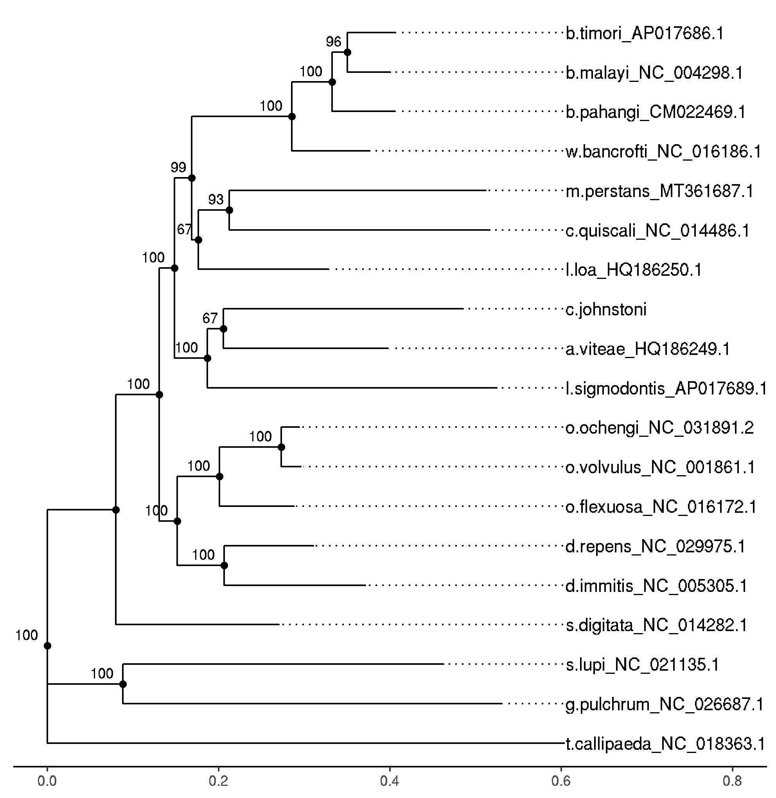

# Cercopithifilaria johnstoni genome project: Post Peer Review updates

Copyright (c) 2021, Stephen R Doyle
All rights reserved.

This source code is licensed under the BSD-style license found in the LICENSE file in the root directory of this source tree.

## Authors:
- Stephen Doyle (Wellcome Sanger Institute, ex LTU)


## Reviewer 1: Q1
- 1. It would be helpful to know the phylogenetic placement of C. johnstoni in the filarial nematodes from this paper. Perhaps Table 1 could include the phylogenetic relationships.

- Response
     - make phylogeny from whole mitochondrial genomes
     - downloaded whole mitochondrial genomes from NCBI for filarial species shown in Table 1, plus a couple more
     - use these to make a phylogeny to place C. johnstoni
>a.viteae_HQ186249.1
>b.malayi_NC_004298.1
>b.pahangi_CM022469.1
>b.timori_AP017686.1
>c.johnstoni
>c.quiscali_NC_014486.1
>d.immitis_NC_005305.1
>d.repens_NC_029975.1
>g.pulchrum_NC_026687.1
>l.loa_HQ186250.1
>l.sigmodontis_AP017689.1
>o.flexuosa_NC_016172.1
>o.ochengi_NC_031891.2
>o.volvulus_NC_001861.1
>s.digitata_NC_014282.1
>s.lupi_NC_021135.1
>t.callipaeda_NC_018363.1
>w.bancrofti_NC_016186.1


```bash
# combine all individual fasta files into a single file
cat *fa > mtDNA_genomes.fa

# run MAFFT to generate an alignment
bsub.py 10 mafft "/nfs/users/nfs_s/sd21/lustre118_link/software/anaconda2/bin/mafft  --globalpair --maxiterate 16 --reorder mtDNA_genomes.fa \> mtDNA_genomes.aln"

# run iqtree to generate a ML phylogeny
bsub.py 10 iqtree "iqtree2 -s mtDNA_genomes.aln -B 1000 -o s.digitata_NC_014282.1,t.callipaeda_NC_018363.1,g.pulchrum_NC_026687.1,s.lupi_NC_021135.1 -redo"

# run iqtree to generate a ML phylogeny
bsub.py 10 iqtree-gb "iqtree2 -s mtDNA_genomes.aln-gb -B 1000 -o s.digitata_NC_014282.1,t.callipaeda_NC_018363.1,g.pulchrum_NC_026687.1,s.lupi_NC_021135.1 -redo"
```

```R
# load library
library(ggtree)
library(ape)

# load data
data <- ggtree::read.tree("mtDNA_genomes.aln.treefile")

# reroot tree
data <- root(data,19)

# make tree
ggtree(data) +
     geom_tiplab(align=TRUE) +
     geom_nodepoint() +
     geom_nodelab(vjust=-.5, hjust=1.5, size=3) +
     theme_tree2() +  ggplot2::xlim(0, 0.8)


# save it
ggsave("mtDNA_phylogeny.pdf")
ggsave("mtDNA_phylogeny.png")
```



- note: curated the figure in Illustrator, making it a bit more pretty and adding Wolbachia annotation


## Reviewer 1: Q2a
- 2a. In the search for Wolbachia in *C. johnstoni* the authors found that 0.02% of reads mapped to Rickettsiales. What is the % of reads from the *O. volvulus* sequencing project that maps to Rickettsiales? This comparison is necessary as this report will be cited as evidence of Wolbachia loss.

- Response
     - need to run kraken on some *O. volvulus* samples
     - at the same time, need to check how sensitive kraken is to detecting Wolbachia if it is in fact there. The 0 Wb in Cj could simply be becasue kraken is not picking it up, not that it is in fact absent
     - NOTE: some playing about found that the default kraken wasnt that sensitive, which may simply be because the Wolbachia genome in the kraken database is probably a non-filarial species.
     - To fix this, need to add filarial wolbachia to the kraken database.

```bash
# fix genome headers to be compatible with kraken, adding in taxonids (need to look these up in NCBI))
bioawk -c fastx '{print ">"$name"|kraken:taxid|292805\n"$seq}' wBm.fasta > wBm.tax.fasta
bioawk -c fastx '{print ">"$name"|kraken:taxid|96495\n"$seq}' wBp.fasta > wBp.tax.fasta
bioawk -c fastx '{print ">"$name"|kraken:taxid|1096564\n"$seq}' wDimm.fasta > wDimm.tax.fasta
bioawk -c fastx '{print ">"$name"|kraken:taxid|1354675\n"$seq}' wLsig.fasta > wLsig.tax.fasta
bioawk -c fastx '{print ">"$name"|kraken:taxid|1141110\n"$seq}' wOo.fasta > wOo.tax.fasta
bioawk -c fastx '{print ">"$name"|kraken:taxid|1410384\n"$seq}' wOv.fasta > wOv.tax.fasta
bioawk -c fastx '{print ">"$name"|kraken:taxid|886893\n"$seq}' wPip.fasta > wPip.tax.fasta
bioawk -c fastx '{print ">"$name"|kraken:taxid|2591635\n"$seq}' wCauA.fasta > wCauA.tax.fasta
bioawk -c fastx '{print ">"$name"|kraken:taxid|1317678\n"$seq}' wMel.fasta > wMel.tax.fasta
bioawk -c fastx '{print ">"$name"|kraken:taxid|2732594\n"$seq}' wCfeJ.fasta > wCfeJ.tax.fasta
bioawk -c fastx '{print ">"$name"|kraken:taxid|2732593\n"$seq}' wCfeT.fasta > wCfeT.tax.fasta
bioawk -c fastx '{print ">"$name"|kraken:taxid|246273\n"$seq}' wCle.fasta > wCle.tax.fasta
bioawk -c fastx '{print ">"$name"|kraken:taxid|1812111\n"$seq}' wCtub.fasta > wCtub.tax.fasta
bioawk -c fastx '{print ">"$name"|kraken:taxid|1812112\n"$seq}' wDcau.fasta > wDcau.tax.fasta
bioawk -c fastx '{print ">"$name"|kraken:taxid|169402\n"$seq}' wFol.fasta > wFol.tax.fasta
bioawk -c fastx '{print ">"$name"|kraken:taxid|125593\n"$seq}' wTpre.fasta > wTpre.tax.fasta


# download a kraken database
wget https://ccb.jhu.edu/software/kraken/dl/minikraken.tgz
tar -xvzf minikraken.tgz

# add the new sequences to the kraken database, and then rebuild it.
for i in *.tax.fasta; do
     kraken-build --add-to-library ${i} --db /nfs/users/nfs_s/sd21/lustre118_link/databases/kraken/minikraken_20141208; done

kraken-build --build --db /nfs/users/nfs_s/sd21/lustre118_link/databases/kraken/minikraken_20141208
```


- need to get some O. volvulus data.
- decided to use Choi et al Nat Micro 2016 https://doi.org/10.1038/nmicrobiol.2016.207, which has 32 samples and so should give a good representation

```bash
# download the fastq reads from ENA
bsub.py --queue long 1 get_data "./download_data.sh"

```
where "download_data.sh" is:

```bash
cut -f9 sample_data.txt | sed 's/;/\t/g' |  while read -r R1 R2; do wget ftp://${R1%_1.fastq.gz}* ; done

```

- run kraken for all datasets

```bash
# load kraken
module load kraken/1.1.1

# write a kraken run script for each sample set
paste <(ls -1 *_1*gz) <(ls -1 *_2*gz) | while read line; do
echo "bsub.py --threads 7 10 kraken_${line%_1.*} \"kraken -db /nfs/users/nfs_s/sd21/lustre118_link/databases/kraken/minikraken_20141208 --threads 7 --output ${line%_1.*}.kraken.out --paired ${line} \"
bsub.py --done kraken_${line%_1.*} 1 kraken_${line%_1.*}_report \"kraken-report ${line%_1.*}.kraken.out \> ${line%_1.*}.kraken.report\"" ;
done > run_kraken.sh

chmod a+x run_kraken.sh
./run_kraken.sh
```

- clean up
```bash
rm *.gz
rm *out
rm *.[oe]
```

- as there is only one sample for C. johnstoni, will run separately
```bash
bsub.py --threads 7 10 kraken_CJ \
     "kraken \
     --threads 7 \
      --db /nfs/users/nfs_s/sd21/lustre118_link/databases/kraken/minikraken_20141208 \
      --output CJ.kraken.out.txt \
      ../CJ/Cj3-500-700_S1_L001_R1_001.fastq.gz ../CJ/Cj3-500-700_S1_L001_R2_001.fastq.gz"

bsub.py --done kraken_CJ 1 kraken_report_cj "kraken-report CJ.kraken.out.txt \> CJ.kraken.report"
```
- summarise the data

```bash
# collate
grep -H "Wolbachia$" SRR*.kraken.report | awk '{print "OV",$1,$2}' OFS="\t" > kraken_summary.txt

grep -H "Wolbachia$" CJ*report | awk '{print "CJ",$1,$2}' OFS="\t" >> kraken_summary.txt

data

```
- output   
| species 	|    mean   	|  std-deviation  	| min  	| max   	|
|:-------:	|:---------:	|:---------------:	|------	|-------	|
| OV      	| 1.9846875 	| 2.7516001026675 	| 0.08 	| 13.26 	|
| CJ      	| 0         	| nan             	| 0    	| 0     	|   

- clear Cj has no Wolbachia, and Ov samples have ~2%
- given Wolbachia genome size of 1 M and O. volvulus genome size of 100 Mb, suggests ~2:1 Wb:nuclear genomes

## Reviewer 1: Q2b
- 2b. For the other Wolbachia searches, it is unclear to me if the authors used the assembled contigs before or after blobtools decontamination. If after, it is not surprising that there is so little evidence of matches.


## Reviewer 2
- no corrections needed


## Reviewer 3: Q1
- I was surprised to see genome completeness scores over 94% with an assembly using only short-read sequence data. Could this relate to short introns with less repetitive elements?
- Response
     - just a comment


## Reviewer 3: Q2
- As this parasite is a useful model for onchocerciasis, it would be good to show the completeness of gene models specific to parasite-host interactions in Onchocerca and related species.
- Response
     - just a comment

## Reviewer 3: Q3
- The mt genome was also assembled and annotated but there was no description of the mt genome herein. A mt phylogenomic tree might provide the reader with more context of the taxonomic position of this parasite.
- Response
     - made a tree, see code above

## Reviewer 3: Q4
- Did the lack of RNAseq data affect gene model predictions? If not, then the findings herein would be strong support for relying only on amino acid sequence homology for training ab initio gene predictors. It would simplify efforts to complete the genome annotations for some taxa.

- response
     - good question,
     - will reannotate Acanthocheilonema viteae and Onchocerca volvulus using ProtHint, and compare against published versions

### Acanthocheilonema viteae
```bash
mkdir /nfs/users/nfs_s/sd21/lustre118_link/cercopithifilaria_johnstoni/POST_PEER_REVIEW/ANNOTATION_COMPARISON
cd /nfs/users/nfs_s/sd21/lustre118_link/cercopithifilaria_johnstoni/POST_PEER_REVIEW/ANNOTATION_COMPARISON

mkdir OV AV

cd AV

wget https://ftp.ebi.ac.uk/pub/databases/wormbase/parasite/releases/WBPS16/species/acanthocheilonema_viteae/PRJEB1697/acanthocheilonema_viteae.PRJEB1697.WBPS16.genomic.fa.gz
gunzip *gz

# fix the fasta header
cut -f1 -d " " acanthocheilonema_viteae.PRJEB1697.WBPS16.genomic.fa > acanthocheilonema_viteae.PRJEB1697.WBPS16.genomic.fix.fa

# run ProtHint
bsub.py --threads 20 10 prothint "/nfs/users/nfs_s/sd21/lustre118_link/software/TRANSCRIPTOME/ProtHint/bin/prothint.py --threads 20 acanthocheilonema_viteae.PRJEB1697.WBPS16.genomic.fa /nfs/users/nfs_s/sd21/lustre118_link/software/TRANSCRIPTOME/ProtHint/databases/odb10_metazoa/odb10_metazoa_proteins.fa"

# run Braker
export AUGUSTUS_CONFIG_PATH=/nfs/users/nfs_s/sd21/software/augustus-3.2.1/config
export AUGUSTUS_SCRIPTS_PATH=/nfs/users/nfs_s/sd21/software/augustus-3.2.1/scripts
export BAMTOOLS_PATH=/nfs/users/nfs_s/sd21/lustre118_link/software/bamtools/bin
export GENEMARK_PATH=/nfs/users/nfs_s/sd21/lustre118_link/software/TRANSCRIPTOME/ProtHint/dependencies/GeneMarkES
export LD_LIBRARY_PATH=$LD_LIBRARY_PATH:/software/gcc-4.9.2/lib64/libstdc++.so.6
export BAMTOOLS_PATH=/nfs/users/nfs_s/sd21/lustre118_link/software/bamtools/bin

# run Braker2
bsub.py --queue long --threads 20 20 braker2 "/lustre/scratch118/infgen/team133/sd21/software/TRANSCRIPTOME/BRAKER_v2.0/braker.pl --genome=acanthocheilonema_viteae.PRJEB1697.WBPS16.genomic.fix.fa --hints=prothint_augustus.gff --gff3 --cores 20 --extrinsicCfgFile=extrinsic.M.RM.E.W.P.C.cfg"

# once finished, run BUSCO
bsub.py 10 busco_proteins "/nfs/users/nfs_s/sd21/lustre118_link/software/ASSEMBLY_QC/busco_v3/scripts/run_BUSCO.py --in augustus.aa --out av_proteins_nematoda --mode proteins --lineage_path /nfs/users/nfs_s/sd21/lustre118_link/databases/busco/nematoda_odb9/ --species caenorhabditis --tarzip --force --long --blast_single_core --tmp_path .tmp --force"
```

### Onchocerca volvulus
```bash
cd ../OV

wget https://ftp.ebi.ac.uk/pub/databases/wormbase/parasite/releases/WBPS16/species/onchocerca_volvulus/PRJEB513/onchocerca_volvulus.PRJEB513.WBPS16.genomic.fa.gz
gunzip *gz

# fix the fasta header
cut -f1 -d " " onchocerca_volvulus.PRJEB513.WBPS16.genomic.fa > onchocerca_volvulus.PRJEB513.WBPS16.genomic.fix.fa


# run ProtHint
bsub.py --threads 20 10 prothint "/nfs/users/nfs_s/sd21/lustre118_link/software/TRANSCRIPTOME/ProtHint/bin/prothint.py --threads 20 onchocerca_volvulus.PRJEB513.WBPS16.genomic.fix.fa /nfs/users/nfs_s/sd21/lustre118_link/software/TRANSCRIPTOME/ProtHint/databases/odb10_metazoa/odb10_metazoa_proteins.fa"

# run Braker
export AUGUSTUS_CONFIG_PATH=/nfs/users/nfs_s/sd21/software/augustus-3.2.1/config
export AUGUSTUS_SCRIPTS_PATH=/nfs/users/nfs_s/sd21/software/augustus-3.2.1/scripts
export BAMTOOLS_PATH=/nfs/users/nfs_s/sd21/lustre118_link/software/bamtools/bin
export GENEMARK_PATH=/nfs/users/nfs_s/sd21/lustre118_link/software/TRANSCRIPTOME/ProtHint/dependencies/GeneMarkES
export LD_LIBRARY_PATH=$LD_LIBRARY_PATH:/software/gcc-4.9.2/lib64/libstdc++.so.6
export BAMTOOLS_PATH=/nfs/users/nfs_s/sd21/lustre118_link/software/bamtools/bin


bsub.py --queue long --threads 20 20 braker2 "/lustre/scratch118/infgen/team133/sd21/software/TRANSCRIPTOME/BRAKER_v2.0/braker.pl --genome=onchocerca_volvulus.PRJEB513.WBPS16.genomic.fix.fa --hints=prothint_augustus.gff --gff3 --cores 20 --extrinsicCfgFile=extrinsic.M.RM.E.W.P.C.cfg"

# run BUSCO
bsub.py 10 busco_proteins "/nfs/users/nfs_s/sd21/lustre118_link/software/ASSEMBLY_QC/busco_v3/scripts/run_BUSCO.py --in augustus.aa --out ov_proteins_nematoda --mode proteins --lineage_path /nfs/users/nfs_s/sd21/lustre118_link/databases/busco/nematoda_odb9/ --species caenorhabditis --tarzip --force --long --blast_single_core --tmp_path .tmp --force"
```

- A. viteae
     - Genes: original: 10,397, de novo: 12,056
     - BUSCOS: original: C: 88.3 [S:86.5, D:1.8], F:8.8, M:2.9, de novo: C: 92.4 [S:82.6, D:9.8], F:5.6, M:2.0

- O. volvulus
     - Genes: original: 12,109, de novo: 12473
     - BUSCOs: original: C:99.2 [S:98.3, D:0.9], F:0.8, M:0.0,  de novo: C:98.8 [S:88.9, D:9.9], F:1.0, M:0.2

- clearly has worked better than the previous annotation of A. viteae, and is very close to O. volvulus
